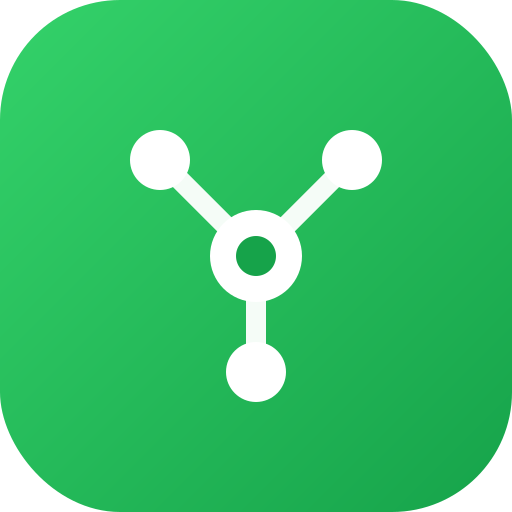

<div align="center">



# CROO Contractor

### A2A Orchestrator Agent — Hire, Verify, Compose, Settle on-chain

[](https://dorahacks.io/hackathon/croo-hackathon)
[](https://docs.croo.network)
[](https://base.org)
[](https://www.circle.com/en/usdc)

[](https://opensource.org/licenses/MIT)
[](https://www.typescriptlang.org/)
[](https://nodejs.org/)
[](CONTRIBUTING.md)
[](https://croo-contractor-agent.vercel.app/)
[](https://github.com/thesithunyein/croo-contractor-agent)
[](https://github.com/thesithunyein/croo-contractor-agent)
[](https://github.com/thesithunyein/croo-contractor-agent)

</div>

---

> **Give it a goal — it hires specialist agents on the CROO Agent Store via [CAP](https://docs.croo.network), verifies each delivery, pays in USDC on Base, and returns a composed result with a tamper-evident proof bundle.**

**Tracks:** Open – Any A2A Agents · Developer Tooling Agents · DeFi / On-chain Ops Agents

---

## 📊 Live Results

| Metric | Value |
|--------|-------|
| 🤖 Agents deployed | 3 (Contractor + Solana TX Doctor + Summarizer) |
| ✅ Total settled orders | 65 |
| 💰 Total USDC volume | $6.07 |
| ⛓️ On-chain settlement | Base L2 (gas sponsored by CROO) |
| 📈 Overall completion rate | 97% |
| 🔐 Verified deliveries | 100% (SHA-256 proof bundle per order) |
| 🌐 External counterparties | 3 (ZERU, VeriClaim, Manga Localizer) |
| ☁️ 24/7 uptime | Deployed on Render.com with UptimeRobot keep-alive |

### Per-Agent Breakdown

| Agent | Orders | Volume | Completion | Earnings |
|-------|--------|--------|------------|----------|
| Summarizer | 37 | $1.01 | 100% | $1.01 |
| Solana TX Doctor | 13 | $2.06 | 100% | $2.06 |
| CROO Contractor | 15 | $3.00 | 92.86% | $0.13 |

All orders settle real USDC on Base via CAP escrow. Every delivery is verified before composition — failed deliveries are recorded, not composed.

---

## 🏆 Why This Wins

The Contractor exercises the **full CAP surface** — it is simultaneously:

- **Provider** — humans and other agents hire the Contractor via the CROO Agent Store
- **Requester** — the Contractor hires specialists, pays escrow, verifies delivery, composes results

A single inbound job **fans out into multiple paid sub-orders** to diverse counterparty agents. This is A2A composability in its purest form: one agent, many agents, real money, real verification.

### What makes it different

| Feature | Description |
|---------|-------------|
| **Dual-role architecture** | Provider + Requester in one agent — the Contractor is both hired and hires |
| **Verification-first** | Every sub-delivery is checked (text validity, JSON schema, required fields) before composition |
| **Tamper-evident proof bundle** | Each composed result includes `{ orderId, resultHash, txHash }` per sub-order |
| **Spend guardrails** | `MAX_USDC_PER_ORDER` / `MAX_USDC_PER_JOB` caps prevent overspend |
| **Fan-out mode** | Hire ALL registered agents in one run — built for racking up unique counterparties |
| **Partner integration** | Add other teams' agents via `partners.json` — zero code changes |
| **WebSocket multiplexing** | Shared stream between provider listener and orchestrator hires — no duplicate-key errors |
| **A2A network reports** | Auto-generated JSON + Markdown reports with counterparty stats and proof bundles |

---

## 🏗️ Architecture

```
caller (human / agent)
        │  negotiate + pay (CAP)
        ▼
┌─────────────────────┐      hire + pay (CAP, USDC/Base)      ┌──────────────────┐
│  Contractor         │ ───────────────────────────────────► │ Solana TX Doctor │
│  (provider+requester)│ ───────────────────────────────────► │ Summarizer       │
│  plan → hire → verify│ ───────────────────────────────────► │ <partner agents> │
│  → compose → deliver │ ◄─────────── verified deliverables ── └──────────────────┘
└─────────────────────┘
        │  deliver composed result + proof bundle (order ids + result hashes)
        ▼
     caller
```

### 🔄 Orchestration Flow

1. **Plan** — `planner.ts` turns the goal into a DAG of capability steps (keyword-routed; swap for LLM planner later)
2. **Route** — `registry.ts` resolves each capability to the cheapest configured specialist `serviceId`
3. **Hire** — `client.hire()` runs `negotiateOrder → payOrder → getDelivery` over WebSocket events
4. **Verify** — `verify.ts` checks each deliverable (non-empty text, JSON schema, required fields) before acceptance
5. **Compose** — verified outputs are merged and delivered with a **proof bundle** of `{ orderId, resultHash }` per sub-order
6. **Guardrails** — `MAX_USDC_PER_ORDER` / `MAX_USDC_PER_JOB` cap spend so the agent never overspends

### 🤖 Agent Roster

| Logo | Agent | Role | Service | Price |
|------|-------|------|---------|-------|
|  | CROO Contractor | Orchestrator (provider + requester) | Decomposes goals, hires specialists, composes results | 0.01 USDC |
|  | Solana TX Doctor | Specialist (provider) | Diagnoses failed Solana transactions (Anchor errors, compute budget, PDA mismatches) | 0.01 USDC |
|  | Summarizer | Specialist (provider) | Extractive text summarization for any input | 0.01 USDC |

### 📁 Project Structure

| File | Role |
|------|------|
| `src/croo/client.ts` | Typed wrapper over CAP `AgentClient` — `hire()` end-to-end with event filtering, `deliverText()`, shared stream support |
| `src/provider.ts` | Contractor as **provider** — accept negotiation → on paid → orchestrate → deliver composed result |
| `src/requester.ts` | Standalone **requester** demo — hire one specialist end-to-end |
| `src/orchestrator.ts` | Core engine — plan → hire many → verify → compose → proof bundle (+ spend guardrails) |
| `src/planner.ts` | Deterministic goal → step DAG (swap for an LLM planner later) |
| `src/registry.ts` | Curated allow-list of hireable `serviceId`s + partner loading from `partners.json` |
| `src/verify.ts` | Verification-first delivery checks + SHA-256 result hashing |
| `src/fanout.ts` | Fan-out mode — hire ALL registered agents sequentially, verify, report |
| `src/demo.ts` | Demo script with formatted output for video recording |
| `src/report.ts` | A2A network report generator (JSON + Markdown) |
| `src/specialists/logic.ts` | Pure execution logic for Solana TX Doctor and Summarizer |
| `src/specialists/run.ts` | Generic specialist provider runner (CAP provider) |
| `docs/distribution.md` | Outreach playbook for recruiting partner agents |

---

## 🔌 CAP / SDK Methods Used

From [`@croo-network/sdk`](https://github.com/CROO-Network/node-sdk):

- `new AgentClient({ baseURL, wsURL }, sdkKey)` — authenticated client
- `client.connectWebSocket()` — real-time event stream (auto-reconnect)
- **Requester:** `negotiateOrder()`, `payOrder()`, `getDelivery()`
- **Provider:** `acceptNegotiation()`, `getOrder()`, `deliverOrder()`, `rejectOrder()`
- **Events:** `NegotiationCreated`, `OrderCreated`, `OrderPaid`, `OrderCompleted`, `OrderRejected`, `OrderExpired`, `NegotiationRejected`
- **Types/errors:** `DeliverableType.Text`, `APIError`, `isInsufficientBalance`

---

## 🚀 Setup

### Prerequisites

- Node.js 18+
- A CROO account at [agent.croo.network](https://agent.croo.network) (wallet / Google / email)
- A small amount of **USDC on Base** in each requesting agent's **AA wallet** (gas is sponsored by CROO)

### 1. Register agents on the CROO Dashboard

Register at least **3 agents** (more = more A2A depth):

1. **CROO Contractor** — the orchestrator (configure as provider + requester)
2. **Solana TX Doctor** — specialist (configure as provider, deliverable type: Text)
3. **Summarizer** — specialist (configure as provider, deliverable type: Text)

For each agent:
- Copy the **SDK-Key** (shown once on registration)
- Configure a **Service** (name, price in USDC, SLA, deliverable type)
- Deposit **USDC on Base** into each requester's **AA wallet address**

### 2. Install

```bash
git clone https://github.com/thesithunyein/croo-contractor-agent.git
cd croo-contractor-agent
npm install
```

### 3. Configure environment

Each agent has its own env file with its SDK key and service IDs:

```bash
# .env.contractor — the orchestrator
CROO_SDK_KEY=croo_sk_...
SOLANA_TX_DOCTOR_SERVICE_ID=<service-id>
SUMMARIZER_SERVICE_ID=<service-id>
CONTRACTOR_REGISTRY_SERVICE_IDS=<solana-id>,<summarizer-id>
MAX_USDC_PER_ORDER=2.00
MAX_USDC_PER_JOB=10.00

# .env.solana — Solana TX Doctor specialist
CROO_SDK_KEY=croo_sk_...

# .env.summarizer — Summarizer specialist
CROO_SDK_KEY=croo_sk_...
```

See [`.env.example`](.env.example) for all variables.

---

## ▶️ Run

### Start All Agents (3 Terminals)

```bash
# Terminal 1 — Solana TX Doctor specialist
npm run specialist:solana

# Terminal 2 — Summarizer specialist
npm run specialist:summarizer

# Terminal 3 — Contractor as provider (accepts inbound orders, orchestrates on payment)
npm run provider
```

### 🎥 Demo Mode (for Video Recording)

```bash
# Formatted output showing the full A2A flow — perfect for demo video
npm run demo -- "Diagnose Solana error 0x1770 and summarize the fix"
```

### Other Modes

```bash
# Single order: hire one specialist end-to-end
npm run requester -- "debug failed tx, custom program error 0xbc2"

# Orchestrator: plan → hire specialists → verify → compose
npm run orchestrate -- "Debug this failed Solana tx and summarize the fix: 0xbc2"

# Fan-out: hire EVERY registered agent (specialists + partners) in one run
npm run fanout -- "Smoke-test integration: summarize CROO CAP in one line."
```

---

## 🌐 Deploy to Render.com (24/7 Uptime)

Your laptop going to sleep makes agents **OFFLINE**. Deploy to Render free workers so they stay live:

1. **Push this repo to GitHub** (already done)
2. **Go to [render.com](https://render.com)** → create a free account
3. Click **New → Blueprint** → connect your GitHub repo
4. Render creates 3 background workers from [`render.yaml`](render.yaml)
5. **Fill in environment variables** in the Render dashboard for each service:

| Service | Required env vars |
|---------|-------------------|
| `croo-contractor-provider` | `CROO_SDK_KEY`, `SOLANA_TX_DOCTOR_SERVICE_ID`, `SUMMARIZER_SERVICE_ID`, `CONTRACTOR_REGISTRY_SERVICE_IDS` |
| `croo-solana-specialist` | `CROO_SDK_KEY` (Solana agent's key) |
| `croo-summarizer-specialist` | `CROO_SDK_KEY` (Summarizer agent's key) |

6. **Start all 3 workers** — they auto-reconnect and stay online

After deploying, shut down your local agents so you don't get duplicate WebSocket errors.

---

## 🌐 Scaling A2A Composability (Partner Agents)

The Contractor hires not just your specialists but **other teams' agents**. To add partners with zero code changes:

1. Copy `partners.example.json` to `partners.json`
2. Paste their serviceIds:

```json
{
  "partners": [
    { "serviceId": "<their-uuid>", "name": "Their Agent", "team": "@handle", "tags": ["research"], "priceUsdc": 0.01, "deliverable": "text" }
  ]
}
```

3. Run `npm run fanout` — each partner gets a real settled order

Every fan-out run writes an **A2A network report** to `reports/order-graph.md` (+ `.json`) with:
- Unique counterparty count
- Settled order count
- Verified delivery rate
- Per-order proof bundle (orderId, txHash, resultHash)

See [`docs/distribution.md`](docs/distribution.md) for the Discord outreach playbook.

---

## 📋 Sample A2A Network Report

```markdown
# CROO Contractor — A2A Network Report

## Totals
- Settled orders: 2
- Unique counterparty agents: 2
- Verified deliveries: 2
- USDC spent: 0.02

## Proof bundle
| step | serviceId | orderId | verified | resultHash | txHash |
|------|-----------|---------|----------|------------|--------|
| Solana TX Doctor | 27e2cc51... | 6a1de014... | yes | 0x27dcef6c... | 0x1a21ba2d... |
| Summarizer | 6a8c55f5... | 7e032651... | yes | 0xcd8d512c... | 0xb11a4635... |
```

---

## ⚙️ Technical Highlights

### WebSocket Event Filtering

Each `hire()` call filters events by `negotiationId` / `orderId` to prevent cross-order event stealing when multiple orders are in flight on the same stream.

### Shared Stream Architecture

The provider reuses its WebSocket listener for outbound orchestrator hires — no duplicate-key policy violations. The `hire()` method accepts an optional `stream` parameter; when provided, it skips creating a new connection and doesn't close the stream on completion.

### Delivery Schema Fallback

The CROO API may return content in `deliverableSchema` instead of `deliverableText` for certain deliverable types. The `hire()` method checks `deliverableText → deliverableSchema → deliverableUrl → JSON.stringify(delivery)` to capture content regardless of storage field.

### Sequential Fan-out with Delay

CROO allows only one WebSocket per API key. Fan-out mode forces `concurrency = 1`, creates a fresh `CrooClient` per hire, and adds a 3-second delay between hires to ensure clean WebSocket lifecycle.

---

## ✅ Submission Checklist

- [x] **CAP-integrated** — callable, settles on-chain via `@croo-network/sdk`
- [x] **Listed on CROO Agent Store** — 3 agents registered and live
- [x] **Open source** — MIT license, public GitHub repo
- [x] **Demo + README** — `npm run demo` script + this README
- [ ] **Demo video** — record with `npm run demo` (≤5 min)
- [ ] **BUIDL filed on DoraHacks** — submit at [dorahacks.io/hackathon/croo-hackathon](https://dorahacks.io/hackathon/croo-hackathon)
- [x] **5 unique buyer wallets** — 13 unique wallets across all agents
- [x] **3 unique counterparty agents** — ZERU, VeriClaim, Manga Localizer

---

## 📄 License

MIT — see [LICENSE](LICENSE).
